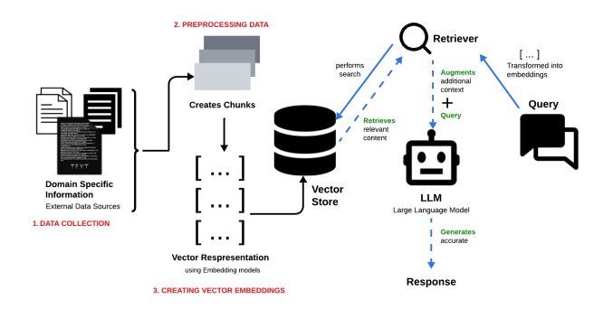

# MDS Capstone Course Report

##  Automated Data Extraction from Coroner's Reports

### _Adam Holt  21689348_


## Introduction

The [coroner project](https://github.com/AdamUWA/coroner) is result of the work of myself and my team collaborating with Dr. Matt Albrecht to produce a self contained document processing application for the extraction of information related to the conditions and potential causes of road fatalities contained in official coroner's reports for the [The Western Australian Centre for Road Safety Research (WACRSR)](https://www.uwa.edu.au/projects/centre-for-road-safety-research/wacrsr-site-link). The purpose of this report is to document my personal contribution to the the project.


## Tasks

My role was team leader. In this capcity I administered all aspects of the project development; acted as the primary client liaison (REF); and my research informed the proposal presented to and accepted by our client (REF). The approach I took was to delineate the requisite **work** as follows:

1. Research and review
2. System design
3. System implementation

Each component of the **work** laid the groundwork for the next. Focusing specifically on the third component, I designed, implemented, and tested the entire application architecture end to end (see coroner). Writing all of the necessary software modules, managing dependencies, and creating and configuring the virtual environment in which the application is deployed on the local system. During this development I utilised generated code sparingly, preferring to leverage library/API documentation and traditional programming techniques of writing, testing, and debugging in conjuction with intuition lead trial and error.

Finally, I provided instruction and guidance to all team members regarding all aspects of the project not limited strictly to technical matters. For example, by making pre-recorded demonstration videos for individuals and the group to demostrate key elements of the system and dependencies; by providing templates from which to begin certain tasks; and by helping team members with thier own specific tasks.


## Methods & Results

### Problem Formulation

My decision making framework for method selection can be divided into two approaches. Firstly, an intuition based methodology derived from domain knowledge and past experience. Secondly, a purely analytical methodology utilising standard academic methods of literature review and research. For the intuitive approach I relied on knowledge developed from previous coursework (eg., Natural Language Processing; Deep Learning; etc) and personal interests such as databases; Large Language Models (LLM); and Retrieval Augmented Generation (RAG) systems. This intuition enabled me to recognise important aspects of the project requirements; the relevant/appropriate methods; and the direction of focus for further investigation via the second approach - traditional research. The result of this process was to recognize that the problem, automated data extraction, would be optimally solved with a dynamic RAG system. And that the system would need to address the following **requirements**:

- Unstructured data inputs (i.e., poor quality scanned PDF documents).
- Dynamic information retrieval requests (i.e., non-static user queries).
- Strictly local hosting and execution (eg., restricted from networked external API calls).

The general methodology employed is thus comprised of intuition grounded in predeveloped knowledge; traditional academic research; and ad hoc problem identification and formulation.


### Problem Solving

Based on the formulated problem, the **requirements** therefore depend upon the following implementation **techniques**:

- Data preprocessing pipeline with Optical Character Recognition (OCR) capabilites.
- RAG with vector database for similarity search based context retrieval in conjuction with pre-trained LLMs for query/context augmentation.
- On device generative LLM hosting and non-remote in-memory vector store.

For detailed rational behind the above **techniques** refer to the [TODO] [project overview](LINK) wherein the architecture of the system was heavily inspired by the experience report of Khan and Hasan (REF) whithin which the authors present Figure 1.

<br>



_Figure 1. RAG system architecture_

<br>

Several factors influenced the main design choice to use a RAG system. Firstly, the system would need to handle _dynamic_ requests. Specifically, a _static_ rules based system for information extraction was inappropriate as it would require determining/enumerating all possible peices of information that may be requested. For example, regular expression matching is optimal for deterministic and precise pattern matching in structured text (REF) whereas RAG is superior for tasks involving contextual reasoning and can modulate generative results with _dynamic_ and factually grounded knowledge retrieval from unstructured data (REF). Furthermore, regular expression systems are often brittle and present difficulties in implementation (REF).

OCR integrated document preprocessing is a well established standard technique for dealing with poor quality text based data. Given that the system was required to handle scanned copies of the original reports as the default input format, OCR was the natural choice (REF Hasan&Khan). The process and implementation specifics were inspired by the Docling project. Additional choices for the system such as pre-chunking and serializing the documents into JSON ojbect file for efficient vector store loading were influenced by Auer et al from their Docling Technical Report (REF). System dependent document preprocessing times are exhibited in Figure 2.


<br>

| Document | Pages | Pre-processing Time (sec) |
|----|----|----|
| Rodier-Finding.pdf | 6 | 31.14 |
| Blood-results-redacted.pdf | 7 | 26.1 |
| Forkin-finding-2014.pdf | 20 | 80.02 |
| TAULELEI-Jacob-Finding.pdf | 35 | 156.53 |
| Baby-H-finding.pdf | 50 | 200.99 |
| Nicholls-Diver-finding.pdf | 172 | 582.72 |

_Table 1. OCR document preprocessing times with chunking & serializing. System: Apple M3 (10 core) with GPU accelaration._

<br>

The system dependence of the pre-processing times highlights the requirement for security which is derived from the sensitive nature of the documents. The need for local execution and on device model hosting mean that benefits are tempered with limitations in such a design. The benefits being self containment, security, and privacy. The limitations being hardware dependent contstraints on model choice and execution efficiency. The key take-away is that such constraints introduced by project specific requirements introduce trade-offs at multiple levels of any system. Furthermore, blind spots were discovered post implementation. Such as human introduced bias of query choices and the use of general purpose pre-trained models. In hindsight, domain specific alignment with formal legal document sources may provide a superior results, eg., utilising models specifically trained for such purposes. [Generalisability]


### Ethical, Responsible AI and Broader Social Impact

Erroneous results from generative models in many cases do not pose significant risks (eg., generative art). But, in this case errors can be dangerous. The purpose of the system is to analyse coroner's reports which contain the circumstances and potential causes of fatalities. To inform policy making so as to mitigate such fatalities the ouputs of the system must have high fidelity and correctness. For this reason a combined evaluation framework of quantitative and qualitative methods is necessary. Statistical/semantic level metrics (eg., BertScoring REF) in conjuction with human oversight and monitoring can ameliorate, but not eliminate, the risks (REF).


## Personal Reflection

What were the technical and non-technical challenges and how did you overcome them?

Technical challenges stemmed primarily from the strict security requirements. Specifically, ...

What would you do differently, given your new experience and limits on time?

Unfortunately, the final group report was not satisfactory and did not meet my expectations. Integrity and craftsmanship are absent.I in part bear responsibility for this in that I should have recognised at an earlier stage that this aspect of the project was not being executed with care or a high standard of rigor. Furthermore, the report was not completed at a reasonable time in order for me to oversee the result and make the necessary adjustments. For these reasons, our group report has failed to meet the standard of scholarship required. In summary, as the group leader I should have made the executive decision to take control of the situation at an earlier stage and prevented the outcome from taking this shape.


## References

- [A Case Study on Pros and Cons of Regular Expression Detection and Dependency Parsing for Negation Extraction from German Medical Documents. Technical Report](https://arxiv.org/abs/2105.09702)

- [Regexes are Hard: Decision-making, Difficulties, and Risks in Programming Regular Expressions](https://arxiv.org/abs/2303.02555)

- [A Systematic Review of Key Retrieval-Augmented Generation (RAG) Systems: Progress, Gaps, and Future Directions](https://arxiv.org/abs/2507.18910)

- [Engineering RAG Systems for Real-World Applications: Design, Development, and Evaluation](https://arxiv.org/abs/2506.20869v1)


## Appendix


#### Pretrained Models

| Model | Type | Parameters (Billion) | Size (GigaByte) |
|----|----|----|----|
| llama3.2 | LLM | 3.2 | 2.0 |
| phi4-mini | LLM | 3.8 | 2.5 |
| gemma3 | LLM | 4.3 | 3.3 |
| mxbai-embed-large | embedding | .334 | .669 |

_Table A.1. On device pre-trained generative LLMs and embedding models_


<br>


#### Serialised Document Objects

```
{
    "page_content": {

        "INTRODUCTION 2
        In my capacity as the Acting State Coroner, I determined on the basis of 
        information provided by the WA Police in August 2023 that there was 
        reasonable cause to suspect that Frank had died and that his death was a 
        reportable death under the Act. I therefore made a direction to the 
        Commissioner of Police; pursuant to s 23(1) of the Coroners Act 1996 (WA) 
        that the suspected death be investigated."

        }, 
    "page_no": 3,
    "source": "data/Rodier-Finding.pdf"
}
```

_Figure A.1. Example of serialised document chunk in JSON object format with document metadata (i.e., page and source) taken from Rodier-Finding.pdf._


